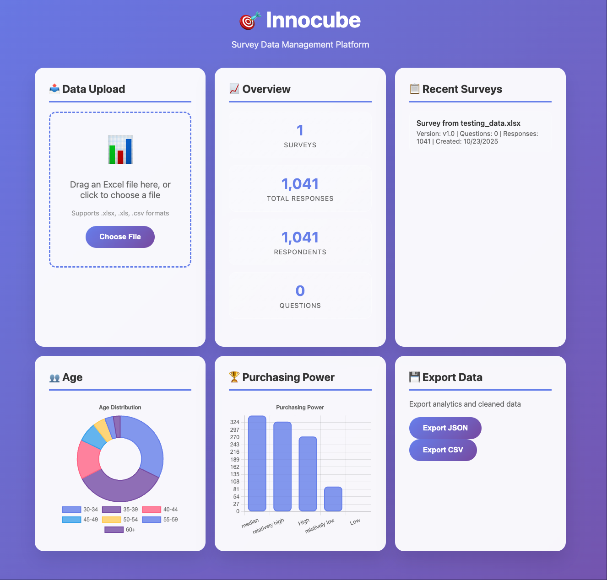

# 🧠 Innocube: Intelligent Survey Analytics Platform



A full-stack web platform that transforms **raw survey Excel files into intelligent analytics dashboards** — powered by Flask, SQLAlchemy, and Chart.js.  
It automatically cleans, aggregates, and visualizes key insights such as **Age Distribution**, **Purchasing Power**, and **Survey Overview** — all within an elegant, interactive UI.

---

## 🎥 Demo Video

Watch the full platform walkthrough on YouTube:  
📺 [https://youtu.be/jyrr1nZk5WA](https://youtu.be/jyrr1nZk5WA)

---

## 🚀 Features

- 📊 **Real-Time Analytics Dashboard**  
  Automatically parses and visualizes survey data (Excel or CSV) into clear demographic and purchasing insights.

- 🧠 **Smart Data Cleaning**  
  Handles mixed-language headers (`年龄`, `购买力等级`, etc.) and converts them into structured fields.

- 💾 **Database Integration**  
  Uses SQLite (local) or PostgreSQL (Docker) via SQLAlchemy ORM.

- ⚙️ **Extensible API Architecture**  
  Modular Flask endpoints for file uploads, analytics, and survey statistics.

- 🧩 **Modern Web Visualization**  
  Powered by **Chart.js** with auto-rendered bar and donut charts.

---

## 🧱 System Architecture

```text
┌─────────────────────────────────────────────┐
│                  Frontend                   │
│     HTML / CSS / Chart.js / Bootstrap        │
└─────────────────────────────────────────────┘
                   │
                   ▼
┌─────────────────────────────────────────────┐
│                  Backend                    │
│   Flask (Python) + SQLAlchemy + Pandas       │
│   - File upload & parsing                    │
│   - Data cleaning & normalization            │
│   - API endpoints (/api/analytics/*)         │
└─────────────────────────────────────────────┘
                   │
                   ▼
┌─────────────────────────────────────────────┐
│                  Database                   │
│       SQLite / PostgreSQL (Docker)          │
└─────────────────────────────────────────────┘
